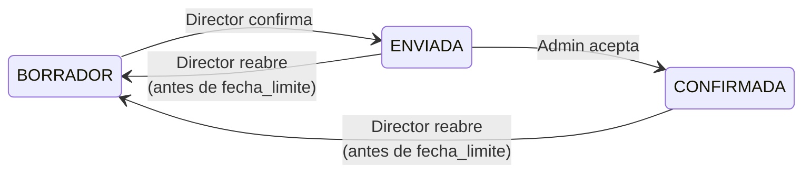
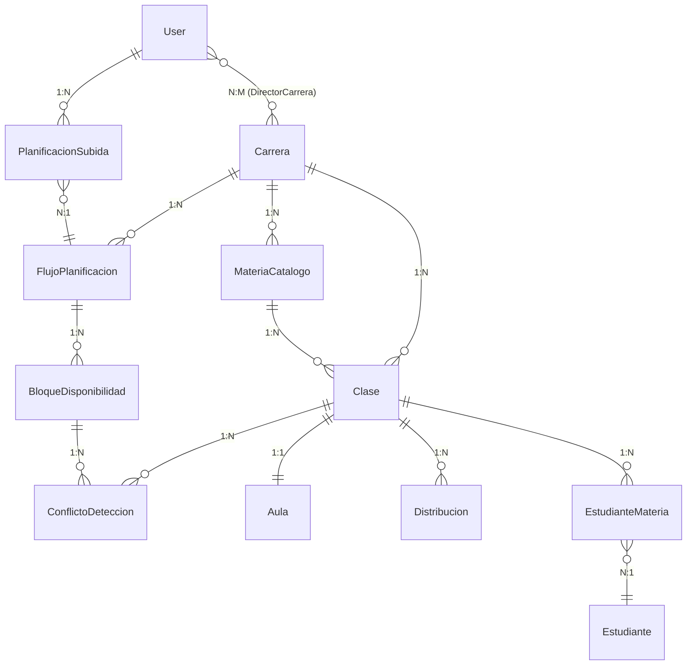
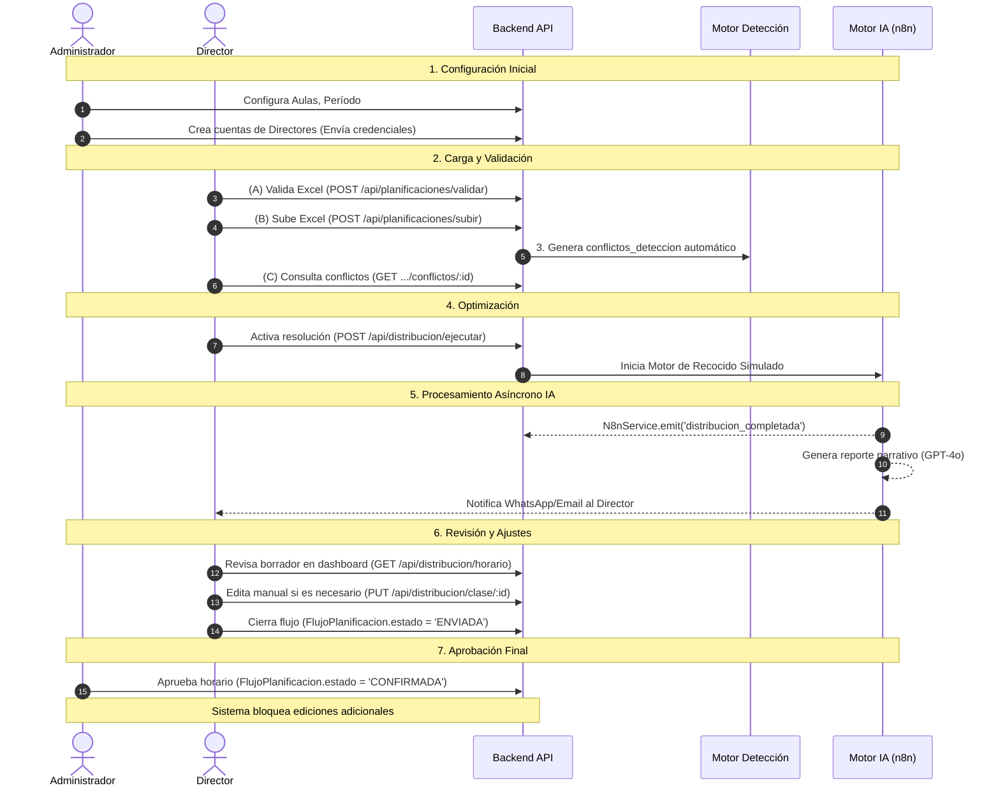

# Manual Técnico del Programador y Arquitectura del Sistema
## Sistema de Gestión Inteligente de Espacios Académicos — SIGEA UIDE (Rommie)

> **Versión del Documento:** 2.0.0  
> **Fecha de Emisión:** Agosto 2026  
> **Clasificación:** Documento Técnico Interno — Uso del Equipo de Desarrollo y Auditores Técnicos  
> **Redacción:** Arquitectura de Software y Documentación Técnica del Proyecto

---

## Tabla de Contenidos

1. [Visión General y Propósito del Sistema](#1-visión-general-y-propósito-del-sistema)
2. [Arquitectura del Sistema y Tecnologías](#2-arquitectura-del-sistema-y-tecnologías)
3. [Modelo de Datos y Gestión de Prioridades Cruzadas](#3-modelo-de-datos-y-gestión-de-prioridades-cruzadas)
4. [Motor de IA y Propuestas de Solución Estratégica](#4-motor-de-ia-y-propuestas-de-solución-estratégica)
5. [Guía de Módulos, Roles y Conectividad](#5-guía-de-módulos-roles-y-conectividad)
6. [Guía Visual para Desarrollo y Mantenimiento](#6-guía-visual-para-desarrollo-y-mantenimiento)

---

## 1. Visión General y Propósito del Sistema

### 1.1 El Problema que Resuelve la Plataforma

La **Universidad Internacional del Ecuador (UIDE)** enfrenta, al inicio de cada período académico, un problema estructural de distribución de espacios físicos: la alta concentración de materias de múltiples carreras en franjas horarias matutinas genera una saturación crítica de aulas y laboratorios especializados. Este fenómeno se agrava significativamente cuando escuelas con necesidades de infraestructura solapadas compiten simultáneamente por los mismos recursos.

El caso más representativo y recurrente ocurre entre la **Escuela de Tecnologías de la Información (TI)** y la **Business School (Contabilidad y Finanzas)**: ambas unidades académicas requieren el uso de laboratorios de cómputo en las mismas franjas horarias del turno de la mañana. Sin embargo, los laboratorios de la Escuela de TI están equipados con software especializado de redes, ciberseguridad y sistemas, lo que los hace parcialmente inapropiados para materias de contabilidad general, y viceversa.

El método de asignación tradicional —basado en hojas de cálculo compartidas y coordinación manual entre Directores de Carrera y el área de Gestión Académica— presenta las siguientes limitaciones críticas:

- **Alta tasa de error humano** en la detección de solapamientos docentes y de aulas.
- **Demoras de semanas** en la resolución de conflictos que requieren negociación entre directores.
- **Subutilización de espacios en franjas tarde/noche**, mientras el turno matutino permanece saturado.
- **Ausencia de historial auditado** sobre la evolución de la planificación por período académico.
- **Imposibilidad de escalar** el proceso a medida que aumenta la oferta de carreras y secciones.

### 1.2 El Valor Estratégico del Motor de Inteligencia Artificial

La plataforma **SIGEA / Rommie** transforma este proceso manual y reactivo en un flujo automatizado, proactivo y trazable. Su valor estratégico se sustenta en tres pilares diferenciadores:

**Pilar 1 — Automatización del Ciclo de Planificación**  
El sistema permite que cada Director de Carrera cargue su planificación semestral en formato Excel mediante una interfaz web intuitiva. La plataforma procesa automáticamente los datos, valida la coherencia de la información y genera un estado de distribución en tiempo real, eliminando la dependencia de procesos manuales de conciliación.

**Pilar 2 — Resolución Inteligente de Conflictos con IA**  
Cuando el sistema detecta sobreocupación o solapamientos —docente dictando dos materias al mismo tiempo, laboratorio prioritario demandado por dos carreras simultáneamente, o capacidad física excedida—, el motor de inteligencia artificial entra en acción. Mediante el algoritmo de **Recocido Simulado (Simulated Annealing)** y modelos de clasificación **k-NN**, el sistema genera automáticamente propuestas de reasignación óptimas: desplazamiento a franjas tarde/noche, asignación a espacios alternativos equivalentes o marcación de préstamos condicionales entre carreras. Este proceso, que manualmente toma días de negociación, el sistema lo resuelve en segundos.

**Pilar 3 — Trazabilidad y Gobernanza Académica**  
Toda decisión de planificación queda registrada en el historial del sistema: quién subió la planificación, cuándo se detectaron los conflictos, qué propuesta de la IA fue aceptada o modificada, y qué Director aprobó la versión final. Esto proporciona a las autoridades académicas un nivel de auditoría y transparencia sin precedentes sobre el uso de los recursos físicos de la institución.

---

`[INSERTAR DIAGRAMA CONCEPTUAL: Vista ejecutiva del ciclo de planificación — desde la carga del Excel hasta la confirmación del horario final. Se recomienda un diagrama de flujo de carriles (swimlane) con los actores: Director de Carrera / Sistema Backend / Motor de IA / Administrador]`

---

## 2. Arquitectura del Sistema y Tecnologías

### 2.1 Descripción de la Arquitectura General

El sistema está construido sobre una **arquitectura orientada a servicios desacoplados** (*Service-Oriented Architecture*, SOA), orquestada mediante **Docker Compose**, que garantiza portabilidad, aislamiento de dependencias y reproducibilidad del entorno tanto en desarrollo local como en producción sobre servidores VPS o instancias en la nube.

La arquitectura se divide en cinco capas funcionales claramente delimitadas:

```
┌─────────────────────────────────────────────────────────────────┐
│                    CAPA DE PRESENTACIÓN                         │
│          React 18 + TypeScript + Vite + Tailwind CSS            │
│              Single Page Application (SPA)                      │
└──────────────────────────┬──────────────────────────────────────┘
                           │  HTTPS / REST + JWT
┌──────────────────────────▼──────────────────────────────────────┐
│                    CAPA DE PROXY INVERSO                        │
│                    Nginx (Puerto 80/443)                        │
│         Termina TLS · Sirve estáticos · Enruta /api/* → BE     │
└──────────────────────────┬──────────────────────────────────────┘
                           │
┌──────────────────────────▼──────────────────────────────────────┐
│                   CAPA DE LÓGICA DE NEGOCIO                     │
│             Node.js 18+ · Express.js · Sequelize ORM            │
│  Autenticación JWT · Parsing Excel · Motor de Distribución      │
└──────┬───────────────────┬────────────────────┬─────────────────┘
       │                   │                    │
┌──────▼──────┐   ┌────────▼────────┐  ┌────────▼────────────────┐
│ PostgreSQL  │   │   Redis 7       │  │   n8n Workflows          │
│ (Puerto     │   │  (Cache + Queue │  │  + OpenAI GPT-4o         │
│  5432)      │   │   Bull Jobs)    │  │  + Anthropic Claude      │
└─────────────┘   └─────────────────┘  └─────────────────────────┘
                                               │
                               ┌───────────────▼─────────────────┐
                               │    Evolution API (WhatsApp)      │
                               │    + Bot Conversacional (Rommie) │
                               └─────────────────────────────────┘
```

### 2.2 Descripción Detallada del Stack Tecnológico

#### A. Capa de Presentación (Frontend)

| Componente | Tecnología | Versión | Propósito Específico |
| :--- | :--- | :--- | :--- |
| Biblioteca UI | React | 18.3.1 | Componentes funcionales con Hooks; estado reactivo y reutilizable. |
| Bundler / Dev Server | Vite | 5.4.5 | HMR ultrarrápido en desarrollo, build optimizado para producción. |
| Tipado Estático | TypeScript | 5.6.3 | Contratos seguros con la API REST del backend; autocomplete en el IDE. |
| Estilos | Tailwind CSS | 3.4.13 | Maquetado utility-first; soporte de temas de modo oscuro. |
| Enrutamiento | React Router DOM | 6.26.0 | Protección de rutas por roles; navegación SPA sin recarga de página. |
| HTTP Client | Axios | 1.7.7 | Interceptores JWT automáticos inyectados en cada petición HTTP. |
| Iconografía | Lucide React + React Icons | 0.563.0 / 5.5.0 | Iconos SVG vectorizados, escalables y sin dependencias externas. |
| Tours de Onboarding | React Joyride | 2.9.3 | Guías interactivas paso a paso para nuevos usuarios del sistema. |
| Fechas y Tiempo | date-fns | 4.1.0 | Formateo y cálculo de fechas sin sobrecargar el bundle del cliente. |
| Testing E2E | Playwright | 1.62.1 | Pruebas de extremo a extremo automatizadas en múltiples navegadores. |

#### B. Capa de Lógica de Negocio (Backend)

| Componente | Tecnología | Versión | Propósito Específico |
| :--- | :--- | :--- | :--- |
| Runtime | Node.js | >= 18.0.0 | Ejecución del servidor asíncrono no bloqueante con Event Loop. |
| Framework HTTP | Express.js | 4.18.2 | Routing, cadena de middlewares y controladores REST modulares. |
| ORM | Sequelize | 6.35.0 | Mapeo objeto-relacional, migraciones estructuradas, asociaciones. |
| Driver SQL | pg / pg-hstore | 8.11.0 | Conexión nativa con PostgreSQL; soporte de tipos JSONB. |
| Autenticación | jsonwebtoken | 9.0.2 | Tokens JWT firmados (HS256), sesiones stateless sin servidor de sesión. |
| Hashing | bcryptjs | 2.4.3 | Hash seguro de contraseñas con salt adaptativo (factor 10). |
| Seguridad HTTP | Helmet.js | 7.1.0 | Cabeceras HTTP seguras: CSP, HSTS, X-Frame-Options, etc. |
| Rate Limiting | express-rate-limit | 7.1.5 | Máx. 5 intentos de login cada 15 minutos; protección DoS y fuerza bruta. |
| Validación | Joi + express-validator | 17.11.0 / 7.0.1 | Doble capa de validación de esquemas de entrada en cada endpoint. |
| Parsing Excel | xlsx | 0.18.5 | Lectura y transformación de archivos .xlsx a estructuras JSON. |
| Upload de Archivos | multer | 1.4.5-lts.1 | Gestión de carga multipart/form-data con límites de tamaño. |
| Generación PDF | pdfmake | 0.3.3 | Informes ejecutivos y horarios generados programáticamente en PDF. |
| Notificaciones Email | nodemailer | 8.0.1 | Envío de credenciales y alertas académicas vía SMTP institucional. |
| SDK de IA | openai | 4.20.0 | Integración directa del backend con GPT-4o para consultas de soporte. |
| Testing | Jest + Supertest | 30.2.0 / 7.2.2 | Pruebas unitarias e integración con simulación de peticiones HTTP. |

#### C. Capa de Datos

| Componente | Tecnología | Propósito |
| :--- | :--- | :--- |
| Base de Datos Relacional | PostgreSQL 15 | Persistencia principal. Integridad referencial, transacciones ACID, índices optimizados para búsquedas de distribución. |
| Cache y Colas | Redis 7 Alpine | Cache de sesiones y estados transitorios. Colas asíncronas Bull para tareas n8n. Aceleración del procesamiento del bot. |

#### D. Capa de IA y Automatización

| Componente | Tecnología | Propósito |
| :--- | :--- | :--- |
| Orquestador de Flujos | n8n Workflows | Conecta el backend con LLMs y servicios de mensajería sin saturar el servidor principal. Lógica low-code mediante nodos visuales. |
| LLM Principal | OpenAI GPT-4o | Generación de reportes prospectivos, clasificación de intenciones y sugerencias narrativas de optimización. |
| LLM Alternativo | Anthropic Claude | Configurado como failover o para análisis de documentos académicos extensos. |
| Algoritmo Core | Simulated Annealing | Resolución estocástica del problema NP-Duro de asignación óptima de clases a aulas. |
| Clasificador | k-NN | Sugerencia de aulas óptimas basada en características históricas de materias similares. |

#### E. Capa de Comunicación y DevOps

| Componente | Tecnología | Propósito |
| :--- | :--- | :--- |
| WhatsApp Gateway | Evolution API v2.3.7 | Pasarela self-hosted REST/WebSocket para envío y recepción de mensajes WhatsApp. |
| Bot Conversacional | Node.js — Rommie | Manejo de sesiones de usuario, consulta de horarios e incidencias por chat. |
| Proxy Inverso | Nginx | Terminación SSL/TLS, enrutamiento de tráfico /api/* → Backend, servicio de estáticos del frontend. |
| Contenedorización | Docker + Docker Compose | Orquestación de todos los servicios en contenedores aislados y reproducibles. |
| Process Manager | PM2 | Reinicio automático y monitoreo de procesos en entornos VPS sin Docker. |

---

### 2.3 Sincronía de Datos: Del Excel a la Base de Datos Relacional

El pipeline de procesamiento de planificaciones académicas es el flujo de datos más crítico del sistema. El ciclo completo de transformación opera en cinco etapas secuenciales:

**Etapa 1 — Recepción del Archivo**  
El Director de Carrera accede al módulo de carga en el frontend, selecciona el período académico y adjunta el archivo `.xlsx`. El frontend envía el archivo mediante una petición `multipart/form-data` al endpoint `POST /api/planificaciones/subir`. El middleware `multer` almacena temporalmente el archivo en `backend/uploads/`.

**Etapa 2 — Validación Previa (Pre-Chequeo No Destructivo)**  
Antes de persistir datos, el sistema invoca `POST /api/planificaciones/validar`. Este ejecuta el parser de `xlsx` y verifica la estructura del archivo: columnas requeridas (código de materia, nombre del docente, días, franja horaria, cupo), tipos de datos y existencia de los docentes referenciados en la base de datos. Se devuelve un reporte de errores de formato sin escribir nada en la base de datos.

**Etapa 3 — Persistencia y Generación de Clases**  
Si el pre-chequeo pasa satisfactoriamente, el controlador `subirPlanificacion` procesa cada fila del Excel y crea registros en la tabla `clases` (un registro por sección de materia) y `planificaciones_subidas` (registro del evento de carga). Se actualiza el `FlujoPlanificacion` correspondiente a la carrera y período al estado `BORRADOR`.

**Etapa 4 — Detección de Conflictos**  
Tras la carga, el motor de detección cruza la nueva planificación contra la matriz de ocupación existente, generando registros en la tabla `conflictos_deteccion` para cada colisión identificada. El Director puede consultar estos conflictos en tiempo real mediante el dashboard.

**Etapa 5 — Distribución Inteligente**  
Con los conflictos identificados, el Director o el Administrador puede solicitar al sistema que ejecute la distribución automática, iniciando el motor de optimización descrito en la Sección 4.

---

`[INSERTAR DIAGRAMA DE SECUENCIA: Flujo completo de carga de planificación. Actores: Frontend (Director) → Nginx → Backend API → PostgreSQL → Motor de Detección de Conflictos. Mostrar mensajes de ida y vuelta con los endpoints involucrados en cada paso]`

---

## 3. Modelo de Datos y Gestión de Prioridades Cruzadas

### 3.1 Entidades del Sistema y Relaciones

El modelo de datos del sistema está implementado íntegramente en PostgreSQL mediante el ORM Sequelize. Las relaciones entre entidades están definidas en el archivo [`backend/src/models/index.js`](file:///c:/Users/sjapo/OneDrive/Documents/Proyectos/gestion-aulas-uide/backend/src/models/index.js). A continuación se describen las entidades principales y sus atributos más relevantes para la lógica de negocio.

#### Entidad `User` (tabla: `usuarios`)

Representa a todos los actores del sistema con acceso autenticado. El campo `rol` es un tipo `ENUM` con los siguientes valores posibles:

| Valor del Rol | Descripción |
| :--- | :--- |
| `admin` | Administrador del sistema. Control total sobre configuración, aulas y distribución. |
| `director` | Director de Carrera. Gestiona la planificación de su unidad académica. |
| `profesor` / `docente` | Docente. Alias intercambiables por compatibilidad histórica. Mismos permisos. |
| `estudiante` | Estudiante. Acceso de solo lectura a horarios y gestión de reservas propias. |

La entidad incluye lógica de seguridad en el modelo mismo mediante hooks de Sequelize (`beforeCreate`, `beforeUpdate`) que encriptan automáticamente la contraseña con `bcryptjs` (salt de factor 10) antes de cualquier escritura. El método `toJSON()` elimina el hash de contraseña de toda respuesta serializada, previniendo su exposición accidental.

#### Entidad `Aula` (tabla: `aulas`)

Representa los espacios físicos disponibles para asignación académica. Sus atributos más críticos para la lógica de negocio son:

| Atributo | Tipo | Descripción |
| :--- | :--- | :--- |
| `codigo` | `STRING(50)` | Identificador único del espacio (ej. `LAB-TI-01`). Clave natural usada como FK en `Clase`. |
| `tipo` | `ENUM` | `AULA`, `LABORATORIO`, `SALA_ESPECIAL`, `AUDITORIO`. Determina elegibilidad en el motor. |
| `capacidad` | `INTEGER` | Número máximo de estudiantes. Validado contra el cupo de cada sección. |
| `es_prioritaria` | `BOOLEAN` | `true` si el aula tiene una carrera titular con preferencia de asignación. |
| `restriccion_carrera` | `TEXT/JSON` | Carreras con derecho de uso prioritario. Acepta JSON array o lista CSV. |
| `estado` | `ENUM` | `disponible`, `no_disponible`, `mantenimiento`, `ocupada`. |
| `equipamiento` | `JSONB` | Inventario de equipos en formato JSON flexible (proyector, PCs, software específico). |

#### Entidad `Clase` (tabla: `clases`)

Constituye el elemento atómico de la planificación académica: la combinación de materia, docente, horario y aula asignada para un período lectivo. Representa una sección específica que se imparte en un slot de tiempo determinado.

**Relaciones principales de `Clase`:**
- `belongsTo Carrera` — identifica la unidad académica propietaria de la sección.
- `belongsTo Docente` — asocia al profesor responsable de impartirla.
- `belongsTo Aula` (por `aula_asignada` ↔ `codigo`) — vincula el espacio físico asignado.
- `belongsToMany Estudiante` (a través de `EstudianteMateria`) — matrícula de alumnos inscritos.
- `hasMany Distribucion` — registros de distribución temporal por día/hora.
- `hasOne BloqueDisponibilidad` — bloque del flujo colaborativo de planificación por período.

#### Entidad `FlujoPlanificacion` (tabla: `flujos_planificacion`)

Gestiona el ciclo de vida del proceso de planificación de cada carrera en cada período académico. Su atributo `estado` implementa la siguiente máquina de estados:



El sistema impide la reapertura de flujos cuya `fecha_limite` ha expirado, a menos que un Administrador emita una `FechaLimiteExtendida` explícita para la carrera en cuestión.

#### Entidad `ConflictoDeteccion` (tabla: `conflictos_deteccion`)

Registra cada colisión detectada automáticamente por el motor de análisis. Se vincula al `BloqueDisponibilidad` que presenta el conflicto y a la `Carrera` solicitante que lo generó. El campo `tipo_conflicto` categoriza la naturaleza del choque: solapamiento docente, saturación de laboratorio prioritario, o capacidad física insuficiente.

#### Entidad `ReasignacionExcepcional` (tabla: `reasignaciones_excepcionales`)

Registra las resoluciones de conflictos que el motor de IA o el Administrador han aplicado, documentando el bloque original, el nuevo espacio o franja asignada y el usuario administrador que autorizó el cambio. Garantiza la trazabilidad completa de toda intervención de reasignación.

---

### 3.2 Mapa Relacional Completo



---

### 3.3 La Lógica de Prioridades Cruzadas en Laboratorios

Este es el mecanismo de negocio más sofisticado del sistema. Comprenderlo es esencial para cualquier desarrollador que mantenga la plataforma.

#### Regla 1: Asignación Preferencial — Titular First

Cuando el motor de distribución busca un aula para una materia de la carrera **TIC**, ejecuta el método estático `Aula.findByCarrera('TIC')`, que construye una consulta SQL ponderada en PostgreSQL:

```sql
SELECT * FROM aulas
WHERE estado = 'disponible' AND tipo != 'AUDITORIO'
ORDER BY 
  CASE 
    WHEN es_prioritaria = true AND (
      restriccion_carrera = 'TIC' OR 
      restriccion_carrera LIKE '%TIC%' OR
      restriccion_carrera LIKE '%"TIC"%'  -- Formato JSON array
    ) THEN 0   -- Prioridad máxima: aparece primero
    ELSE 1     -- Resto de aulas disponibles
  END ASC,
  capacidad ASC;  -- Criterio de desempate: menor capacidad suficiente
```

Este ordenamiento garantiza que los laboratorios de TIC aparezcan siempre primero en la lista de candidatos, sin bloquear físicamente su uso a otras carreras cuando están libres en una franja horaria.

#### Regla 2: Préstamo Condicional — Conditional Loan

Cuando una carrera no titular (ej. Contabilidad) necesita un laboratorio de cómputo y el sistema detecta que el Laboratorio TI-01 está disponible en la franja de las 14:00, puede asignarlo marcando la clase con `prestamo_condicional: true`. Esta asignación queda registrada en `BloqueDisponibilidad` con estado `EN_REVISION`.

**Condición de revocación automatizada:** Si posteriormente el Director de TIC carga una materia para esa misma franja horaria, el motor de conflictos detecta la colisión con el bloque condicional y lo registra en `ConflictoDeteccion`. El motor de IA entonces reasigna automáticamente la materia de Contabilidad al aula estándar equivalente de mayor disponibilidad, liberando el laboratorio prioritario para su carrera titular. Toda la operación queda trazada en `ReasignacionExcepcional`.

#### Regla 3: Reasignación a Franja Tarde/Noche

Cuando no existe ningún laboratorio disponible en la franja matutina para ninguna de las carreras en competencia, el motor de IA evalúa la posibilidad de reubicar una de las secciones en la franja **tarde (14:00–18:00) o noche (18:00–22:00)**, usando el algoritmo de Recocido Simulado para minimizar el impacto en la carga horaria del docente y las preferencias de los estudiantes.

---

`[INSERTAR DIAGRAMA DE FLUJO: Árbol de decisión del Préstamo Condicional. Nodos: "¿Hay laboratorio prioritario disponible?" → Sí: Asignar titular / No → "¿Existe franja tarde disponible?" → Sí: Préstamo Condicional / No → Ejecutar Motor de IA]`

---

## 4. Motor de IA y Propuestas de Solución Estratégica

### 4.1 Fundamento Algorítmico: Por Qué Recocido Simulado

El problema de asignación óptima de materias a aulas pertenece a la familia de los **problemas de satisfacción de restricciones** (CSP), específicamente una variante del problema de *timetabling* académico, clasificado como **NP-Duro**. Esto significa que no existe un algoritmo de tiempo polinomial que garantice la solución óptima global para instancias de tamaño real (decenas de carreras, cientos de materias, múltiples franjas horarias).

El sistema emplea tres estrategias algorítmicas complementarias:

1. **Simulated Annealing (Recocido Simulado):** Metaheurística estocástica que explora el espacio de soluciones permitiendo ocasionalmente movimientos hacia soluciones peores para escapar de óptimos locales. Converge hacia una solución de alta calidad en tiempo polinomial.
2. **k-NN (k-Vecinos más Cercanos):** Clasificador que, basándose en características históricas de materias similares (nivel, carrera, equipamiento requerido), sugiere qué tipo de aula es más adecuado antes de ejecutar el algoritmo principal.
3. **Scoring Heurístico:** Sistema de puntuación que evalúa la calidad de cada asignación propuesta, guiando la búsqueda del algoritmo principal.

### 4.2 El Sistema de Scoring Heurístico

Antes de que el Recocido Simulado decida si acepta o rechaza una nueva asignación, el sistema calcula un **puntaje de calidad** para esa propuesta. Las reglas de scoring están diseñadas para reflejar las prioridades de negocio de la institución:

| Condición Evaluada | Impacto en el Score | Justificación |
| :--- | :--- | :--- |
| Capacidad exacta o ligeramente superior al cupo de la sección | **+100 puntos** | Uso eficiente del espacio; evita aulas sobredimensionadas. |
| Aula prioritaria asignada a su carrera titular | **+80 puntos** | Respeta los derechos de uso institucional. |
| Franja horaria tarde/noche (reduce presión sobre el turno matutino) | **+50 puntos** | Descongestiona el horario de mayor demanda. |
| Capacidad excedida (cupo > capacidad física del aula) | **−200 puntos** | Violación de normativa de seguridad y aforo. |
| Solapamiento docente detectado | **−300 puntos** | Conflicto físicamente imposible; penalización máxima. |
| Préstamo condicional en laboratorio prioritario | **−30 puntos** | Solución válida pero subóptima; puede ser revocada. |
| Desplazamiento de una clase ya confirmada previamente | **−150 puntos** | Genera inestabilidad y retrabajo en la planificación. |

### 4.3 Pseudocódigo del Motor de Distribución

```javascript
/**
 * Motor de Distribución Inteligente — SIGEA UIDE
 * Implementa Recocido Simulado para resolución de conflictos de asignación académica.
 *
 * @param {Array} clasesConConflicto  - Secciones académicas sin aula válida asignada
 * @param {Array} aulasDisponibles    - Espacios con estado='disponible' para el periodo
 * @returns {Object}  Propuesta de distribución óptima con metadatos de trazabilidad
 */
async function resolverConflictosDistribucion(clasesConConflicto, aulasDisponibles) {

    // --- Fase 1: Inicialización del estado ---
    let temperatura = 100.0;
    const tasaEnfriamiento = 0.95;
    const temperaturaMinima = 1.0;

    // Estado inicial greedy: primer aula disponible válida para cada clase
    let estadoActual = await generarEstadoInicial(clasesConConflicto, aulasDisponibles);
    let scoreActual = calcularScoreGlobal(estadoActual);
    let mejorEstado = { ...estadoActual };
    let mejorScore = scoreActual;

    // --- Fase 2: Bucle de optimización por Recocido ---
    while (temperatura > temperaturaMinima) {

        for (const clase of clasesConConflicto) {

            // Paso A: Obtener aulas candidatas pre-ordenadas por el clasificador k-NN
            const candidatos = await kNNSugerirAulas(clase, aulasDisponibles);

            for (const aulaCandidata of candidatos) {

                // Paso B: Detectar colisiones con el estado de distribución actual
                const colisiones = detectarColisiones(clase, aulaCandidata, estadoActual);
                let nuevoScore;

                if (colisiones.tieneConflictoDocente) {
                    nuevoScore = scoreActual - 300; // Penalización máxima

                } else if (colisiones.esPrestamoPrioritario) {
                    // Evaluar si existe franja alternativa antes de aceptar el préstamo
                    const franjaAlterna = buscarFranjaAlternaDisponible(clase, aulasDisponibles);
                    if (franjaAlterna) {
                        nuevoScore = calcularScore(clase, franjaAlterna.aula, franjaAlterna.franja);
                    } else {
                        nuevoScore = calcularScore(clase, aulaCandidata) - 30;
                        clase.marcarPrestamo = true;
                    }

                } else {
                    nuevoScore = calcularScore(clase, aulaCandidata);
                }

                // Paso C: Criterio de Aceptación Metropolis
                // Permite aceptar soluciones peores con probabilidad que decrece con la temperatura
                const delta = nuevoScore - scoreActual;
                const probabilidadAceptacion = Math.exp(delta / temperatura);

                if (delta > 0 || Math.random() < probabilidadAceptacion) {
                    aplicarAsignacion(estadoActual, clase, aulaCandidata);
                    scoreActual = nuevoScore;

                    if (scoreActual > mejorScore) {
                        mejorEstado = clonarEstado(estadoActual);
                        mejorScore = scoreActual;
                    }
                    break; // Candidato aceptado; pasar a la siguiente clase
                }
            }
        }

        // Paso D: Reducir temperatura — enfriamiento exponencial
        temperatura *= tasaEnfriamiento;
    }

    // --- Fase 3: Persistir la mejor propuesta encontrada ---
    return await generarYPersistirPropuestaBorrador(mejorEstado, {
        scoreAlcanzado: mejorScore,
        conflictosResueltos: clasesConConflicto.length,
        timestamp: new Date().toISOString()
    });
}
```

### 4.4 Integración con n8n y OpenAI GPT-4o

El backend se comunica con el orquestador **n8n** mediante el servicio `N8nService`, ubicado en `backend/src/services/n8n.service.js`, que expone tres modos de comunicación distintos:

| Modo | Método | Descripción |
| :--- | :--- | :--- |
| **Fire-and-Forget** | `N8nService.emit(eventType, payload)` | Emite eventos asincrónicos sin bloquear el hilo principal del servidor. |
| **Request-Response** | `N8nService.query({ prompt, contexto })` | Consulta síncrona al orquestador; el backend espera la respuesta de GPT-4o. |
| **Retry de Fallidos** | `N8nService.retryFailedEvents()` | Reintenta eventos fallidos almacenados en la cola de Redis. |

Los **workflows de n8n** configurados en el proyecto son:

- **`sistema-ia-consultas.json`:** Procesa prompts en lenguaje natural con GPT-4o para análisis de distribución, responde preguntas del director sobre el estado de planificación y genera recomendaciones narrativas.
- **`sistema-notificaciones.json`:** Dispara notificaciones multicanal (WhatsApp vía Evolution API + Email vía SMTP) ante eventos clave: conflicto detectado, propuesta de IA disponible, aprobación de director, nueva reserva.
- **`sistema-reportes.json`:** Genera análisis ejecutivos periódicos sobre patrones de saturación por edificio, franja horaria y carrera, usando datos históricos de `distribucion` y `reporte_historial`.

---

`[INSERTAR CAPTURA DEL CANVAS DE N8N: Mostrar el workflow "sistema-ia-consultas.json" completo. Los nodos visibles deben ser: Webhook → Query PostgreSQL → Formatear Prompt → Llamada HTTP OpenAI GPT-4o → Formato Respuesta → Response a Backend]`

---

## 5. Guía de Módulos, Roles y Conectividad (Flujo de Trabajo)

### 5.1 Roles del Sistema y Matriz de Permisos

La autorización en el sistema opera mediante el middleware `verificarRol()` aplicado a nivel de ruta en Express.js. El token JWT del usuario autenticado contiene el campo `rol`, que es validado antes de ejecutar cualquier controlador protegido.

| Permiso / Acción | `admin` | `director` | `docente` | `estudiante` |
| :--- | :---: | :---: | :---: | :---: |
| Gestionar usuarios y directores | ✅ | ❌ | ❌ | ❌ |
| Configurar aulas prioritarias | ✅ | ❌ | ❌ | ❌ |
| Ejecutar distribución forzada | ✅ | ❌ | ❌ | ❌ |
| Emitir eventos a n8n manualmente | ✅ | ❌ | ❌ | ❌ |
| Autorizar fechas límite extendidas | ✅ | ❌ | ❌ | ❌ |
| Subir planificación de carrera | ✅ | ✅ | ❌ | ❌ |
| Ver conflictos de su carrera | ✅ | ✅ | ❌ | ❌ |
| Ejecutar distribución automática | ✅ | ✅ | ❌ | ❌ |
| Ver horario global y mapa de calor | ✅ | ✅ | ❌ | ❌ |
| Aprobar o rechazar reservas | ✅ | ✅ | ❌ | ❌ |
| Ver distribución de sus propias clases | ✅ | ✅ | ✅ | ✅ |
| Consultar aulas disponibles (uso del Bot) | Público | Público | Público | Público |
| Crear y cancelar reservas propias | ✅ | ✅ | ✅ | ✅ |
| Reportar incidencias sobre espacios | ✅ | ✅ | ✅ | ✅ |

### 5.2 Mapa Completo de Endpoints y Conectividad

La siguiente tabla mapea cada endpoint del sistema con su ruta, método HTTP, roles autorizados y la lógica de negocio que ejecuta. Está diseñada para verificar que no existen rutas huérfanas o desconectadas en el sistema.

#### Módulo de Autenticación (`/api/auth`)

| Método | Ruta | Roles | Lógica de Negocio |
| :--- | :--- | :--- | :--- |
| `POST` | `/api/auth/register` | Público | Registra nuevo usuario. Validación doble express-validator + Joi. Hash bcrypt automático. |
| `POST` | `/api/auth/login` | Público | Autentica credenciales, retorna JWT (HS256) + perfil. Rate limit: 5 req/15 min. |
| `POST` | `/api/auth/forgot-password` | Público | Genera token de recuperación y envía email SMTP con enlace temporizado. |
| `POST` | `/api/auth/reset-password` | Público | Valida token de recuperación y establece nueva contraseña hasheada. |
| `GET` | `/api/auth/perfil` | Todos auth. | Retorna perfil del usuario autenticado, sin hash de contraseña. |
| `PUT` | `/api/auth/perfil` | Todos auth. | Actualiza datos del perfil del usuario actual. |
| `PUT` | `/api/auth/cambiar-password` | Todos auth. | Cambia la contraseña verificando la actual antes de proceder. |
| `PUT` | `/api/auth/primer-ingreso` | Todos auth. | Fuerza el cambio de contraseña temporal en el primer acceso al sistema. |
| `POST` | `/api/auth/crear-director` | `admin` | Crea cuenta de director, genera contraseña temporal y envía WhatsApp/email con credenciales. |

#### Módulo de Planificación Académica (`/api/planificaciones`)

| Método | Ruta | Roles | Lógica de Negocio |
| :--- | :--- | :--- | :--- |
| `POST` | `/api/planificaciones/validar` | `admin`, `director` | Pre-valida el Excel sin persistir datos. Retorna informe de errores de formato por fila. |
| `POST` | `/api/planificaciones/subir` | `admin`, `director` | Parsea Excel, crea registros en `clases`, actualiza `FlujoPlanificacion` a BORRADOR. |
| `GET` | `/api/planificaciones/listar` | `admin`, `director` | Lista planificaciones subidas. Admin ve todas; director solo las de su carrera. |
| `GET` | `/api/planificaciones/distribucion` | `admin`, `director` | Estado de distribución global para todas las carreras del período activo. |
| `GET` | `/api/planificaciones/distribucion/:id` | `admin`, `director` | Estado de distribución para una carrera específica por su ID. |
| `POST` | `/api/planificaciones/distribucion/ejecutar` | `admin` | Activa el motor de distribución manual para una carrera o el sistema completo. |
| `GET` | `/api/planificaciones/conflictos/:id` | `admin`, `director` | Retorna todos los conflictos detectados para la carrera especificada. |
| `GET` | `/api/planificaciones/descargar/:id` | `admin`, `director` | Descarga el archivo Excel original subido con el ID indicado. |

#### Módulo de Distribución Inteligente (`/api/distribucion`)

| Método | Ruta | Roles | Lógica de Negocio |
| :--- | :--- | :--- | :--- |
| `GET` | `/api/distribucion/estado` | `admin`, `director` | Estado actual del motor: en proceso / completado / sin iniciar. |
| `POST` | `/api/distribucion/ejecutar` | `admin`, `director` | Invoca el motor de Recocido Simulado para resolver conflictos automáticamente. |
| `POST` | `/api/distribucion/forzar` | `admin` | Ejecuta distribución forzada incluso con datos incompletos (modo de emergencia). |
| `GET` | `/api/distribucion/horario` | `admin`, `director` | Matriz de horario completa por carrera y período académico. |
| `GET` | `/api/distribucion/heatmap` | `admin`, `director` | Métricas de ocupación por bloque horario y edificio (datos para el mapa de calor). |
| `GET` | `/api/distribucion/heatmap-detallado` | `admin`, `director` | Mapa de calor detallado con desglose por aula individual. |
| `GET` | `/api/distribucion/clases` | `admin`, `director` | Listado de todas las clases distribuidas con aula y franja asignada. |
| `GET` | `/api/distribucion/mi-distribucion` | Todos auth. | Cada usuario ve solo sus clases. Docente: las que dicta. Estudiante: las que cursa. |
| `GET` | `/api/distribucion/reporte` | `admin`, `director` | Reporte ejecutivo de distribución en formato estructurado (pre-PDF). |
| `GET` | `/api/distribucion/docentes-carga` | `admin`, `director` | Carga horaria por docente: horas semanales, número de clases y conflictos pendientes. |
| `GET` | `/api/distribucion/clase/:id` | `admin`, `director` | Detalle completo de una clase específica por su ID. |
| `POST` | `/api/distribucion/clase` | `admin`, `director` | Crea una clase manualmente (para casos excepcionales fuera del Excel). |
| `PUT` | `/api/distribucion/clase/:id` | `admin`, `director` | Edita una clase existente (reasignación manual de aula u horario). |
| `DELETE` | `/api/distribucion/clase/:id` | `admin`, `director` | Elimina una clase de la distribución activa. |
| `GET` | `/api/distribucion/disponibilidad` | `admin`, `director` | Verifica disponibilidad de un aula en un bloque horario específico (vía query params). |

#### Módulo de Aulas y Espacios (`/api/aulas`)

| Método | Ruta | Roles | Lógica de Negocio |
| :--- | :--- | :--- | :--- |
| `GET` | `/api/aulas` | Todos auth. | Lista todas las aulas con filtros opcionales de tipo, capacidad y estado. |
| `POST` | `/api/aulas` | `admin` | Crea un nuevo espacio físico con todos sus atributos. |
| `PUT` | `/api/aulas/:id` | `admin` | Actualiza datos de un aula (capacidad, equipamiento, estado). |
| `DELETE` | `/api/aulas/:id` | `admin` | Elimina un aula si no tiene clases asignadas activas en el período. |
| `POST` | `/api/aulas/:id/prioridad` | `admin` | Define o actualiza las carreras titulares de un laboratorio prioritario. |

#### Módulo de Reservas (`/api/reservas`)

| Método | Ruta | Roles | Lógica de Negocio |
| :--- | :--- | :--- | :--- |
| `GET` | `/api/reservas/disponibles` | **Público** | Consulta aulas disponibles para una fecha y franja. Usada por el bot de WhatsApp sin JWT. |
| `POST` | `/api/reservas` | Todos auth. | Crea nueva solicitud de reserva de espacio. Estado inicial: `pendiente`. |
| `GET` | `/api/reservas/mis-reservas` | Todos auth. | Lista las reservas del usuario autenticado. |
| `DELETE` | `/api/reservas/:id` | Todos auth. | Cancela una reserva propia (solo si su estado es `pendiente`). |
| `GET` | `/api/reservas/todas` | `admin`, `director` | Lista todas las reservas del sistema con filtros de fecha y estado. |
| `GET` | `/api/reservas/pendientes` | `admin`, `director` | Lista reservas pendientes de aprobación. |
| `PATCH` | `/api/reservas/:id/estado` | `admin`, `director` | Aprueba o rechaza una solicitud de reserva. Dispara notificación al solicitante. |

#### Módulo de Integración IA (`/api/n8n`)

| Método | Ruta | Roles | Lógica de Negocio |
| :--- | :--- | :--- | :--- |
| `GET` | `/api/n8n/health` | Todos auth. | Verifica que el servicio n8n está activo y accesible desde el backend. |
| `POST` | `/api/n8n/emit` | `admin` | Emite un evento personalizado a n8n (fire-and-forget; no espera respuesta). |
| `POST` | `/api/n8n/query` | `admin` | Envía un prompt a n8n/GPT-4o y espera la respuesta (request-response bloqueante). |
| `POST` | `/api/n8n/retry` | `admin` | Reintenta todos los eventos fallidos almacenados en la cola de Redis. |

---

### 5.3 Flujo de Trabajo Completo: Del Director a la IA y de Vuelta al Director

El flujo de trabajo integrado que conecta todos los módulos anteriores sigue esta secuencia lógica para un ciclo de planificación completo:



---

`[INSERTAR CAPTURA DEL MÓDULO DE DISTRIBUCIÓN: Vista del dashboard del Director con la tabla de clases, sus aulas asignadas y el indicador de estado por sección (sin conflicto / conflicto detectado / préstamo condicional). Mostrar el botón "Ejecutar distribución automática" visible y activo en la interfaz]`

---

## 6. Guía Visual para Desarrollo y Mantenimiento

Esta sección está estructurada como referencia rápida para el equipo de desarrollo y para auditores externos que necesiten verificar visualmente la coherencia del sistema.

---

### 6.1 Diagrama de Arquitectura General del Sistema

`[INSERTAR DIAGRAMA DE ARQUITECTURA AQUÍ]`

> **Descripción:** Diagrama de arquitectura de tres capas (Presentación / Lógica / Datos) con todos los servicios Docker identificados por contenedor. Incluir las flechas de comunicación con los protocolos utilizados (HTTPS, REST, JWT, Sequelize/SQL, Bull/Redis, WebSocket). Referencia: archivo `docker-compose.yml` del proyecto para verificar puertos y dependencias entre servicios.

---

### 6.2 Diagrama del Flujo de Carga y Procesamiento del Excel

`[INSERTAR DIAGRAMA DE SECUENCIA DE CARGA DE EXCEL AQUÍ]`

> **Descripción:** Diagrama de secuencia UML que muestra los intercambios de mensajes entre: Navegador del Director → Nginx → Backend Express → PostgreSQL → Motor de Detección → Respuesta al Frontend. Debe evidenciar las dos fases: validación sin persistencia y carga definitiva con creación de registros en `Clase` y `FlujoPlanificacion`.

---

### 6.3 Captura del Módulo de Validación de Planificación

`[INSERTAR CAPTURA DEL MÓDULO DE VALIDACIÓN AQUÍ]`

> **Descripción:** Captura de la interfaz de carga del Excel mostrando el resultado de la validación previa con errores detallados por fila (ej. "Fila 15: Docente 'García, P.' no encontrado en el sistema" / "Fila 23: Cupo '45' excede capacidad máxima del Laboratorio TI-02 '40'"). Esta vista permite al Director corregir el archivo antes de persistir los datos.

---

### 6.4 Captura del Dashboard del Mapa de Calor

`[INSERTAR CAPTURA DEL MAPA DE CALOR DE OCUPACIÓN AQUÍ]`

> **Descripción:** Interfaz del dashboard con la grilla interactiva de aulas por días de la semana y bloques horarios. Cada celda muestra el porcentaje de ocupación con el gradiente de color definido: **Verde** (0–60% disponible), **Amarillo** (60–85% — atención), **Naranja** (85–99% — crítico) y **Rojo** (100% — saturado / conflicto). Los laboratorios con `es_prioritaria = true` deben diferenciarse visualmente con un borde o etiqueta especial.

---

### 6.5 Captura del Modal de Alerta de Conflicto y Propuesta de IA

`[INSERTAR CAPTURA DEL MODAL DE RESOLUCIÓN DE CONFLICTO AQUÍ]`

> **Descripción:** Modal o panel lateral que aparece cuando el sistema detecta un conflicto de saturación. La vista izquierda muestra el conflicto identificado: tipo (solapamiento docente / saturación de laboratorio / capacidad excedida), materia afectada, docente, horario y aula en conflicto. La vista derecha muestra las opciones propuestas por el motor de IA: aula alternativa sugerida, franja horaria alternativa y el botón de acción "Aplicar Propuesta de IA" con una descripción del razonamiento del algoritmo.

---

### 6.6 Diagrama del Modelo Entidad-Relación Completo de la Base de Datos

`[INSERTAR DIAGRAMA ER COMPLETO AQUÍ]`

> **Descripción:** Diagrama ER generado a partir del esquema real de PostgreSQL. Debe incluir todas las tablas con sus atributos clave, claves primarias (PK), claves foráneas (FK) y cardinalidades de las relaciones. Se recomienda usar DBeaver, pgAdmin 4 o dbdiagram.io conectado a la instancia de desarrollo para generar este diagrama automáticamente.

---

### 6.7 Captura de la Interfaz del Bot Rommie (WhatsApp)

`[INSERTAR CAPTURA DE CONVERSACIÓN DEL BOT ROMMIE AQUÍ]`

> **Descripción:** Captura de WhatsApp mostrando una conversación activa con el bot Rommie. La secuencia visible debe ilustrar el flujo de consulta de horario: el usuario escribe su cédula → el bot autentica → el usuario selecciona "Consultar mi horario de clases" de la lista de opciones → el bot retorna el horario formateado con aula, docente y días de la semana.

---

### 6.8 Guía de Arranque del Entorno de Desarrollo Local

Para incorporar un nuevo desarrollador al proyecto, el entorno de desarrollo local se levanta con los siguientes comandos secuenciales:

```bash
# 1. Clonar el repositorio
git clone https://github.com/[org]/gestion-aulas-uide.git
cd gestion-aulas-uide

# 2. Configurar variables de entorno
cp .env.example .env
# Editar .env con credenciales locales de PostgreSQL, Redis, JWT y SMTP

# 3. Levantar todos los servicios en Docker
docker-compose up -d

# 4. Ejecutar migraciones de base de datos
cd backend && npm run db:migrate

# 5. Levantar el frontend en modo desarrollo (opcional)
cd ../frontend && npm install && npm run dev

# Servicios disponibles en el entorno local:
# Frontend:   http://localhost:5173
# Backend:    http://localhost:3001/api
# n8n:        http://localhost:5678
```

`[INSERTAR CAPTURA DE TERMINAL: Salida del comando "docker-compose ps" con todos los servicios en estado "Up" y sus puertos mapeados. Esta captura confirma que el entorno está correctamente configurado y listo para desarrollo]`

---

`[INSERTAR DIAGRAMA DE PIPELINE CI/CD: Si el proyecto cuenta con GitHub Actions u otro orquestador de CI/CD, insertar el diagrama del pipeline completo: push a rama → tests unitarios (Jest) → tests E2E (Playwright) → build de imagen Docker → deploy a servidor VPS. Referencia: directorio ".github/workflows/" del repositorio]`

---

*Fin del Manual Técnico del Programador — SIGEA UIDE (Rommie) v2.0.0*

