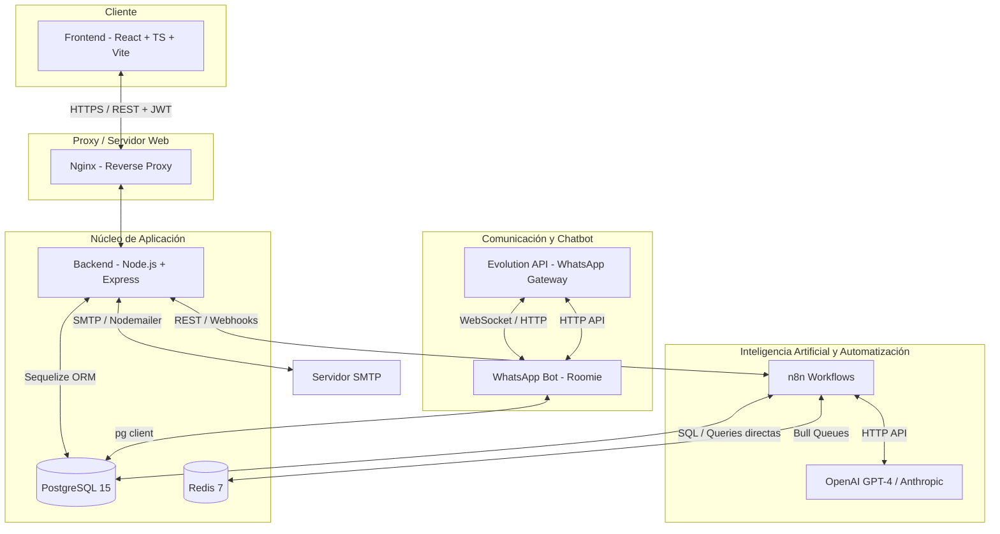

# 🏛️ Informe Técnico: Stack Tecnológico y Arquitectura del Proyecto (SIGEA UIDE)

Este informe presenta un análisis detallado de la arquitectura y las tecnologías utilizadas en el desarrollo del **Sistema de Gestión de Espacios Académicos (SIGEA UIDE)**. El sistema combina desarrollo full-stack moderno, inteligencia artificial y automatización para resolver el problema de la distribución óptima de aulas en la Universidad Internacional del Ecuador.

---

## 1. Arquitectura General del Sistema

El sistema utiliza una arquitectura de **microservicios y servicios interconectados**, orquestados a través de **Docker Compose** para asegurar portabilidad, consistencia y facilidad de despliegue tanto en entornos locales como en producción.

---

## 2. Capa Backend (Servidor y API REST)

El backend actúa como el núcleo transaccional del sistema, encargado de la autenticación, la lógica de negocio primaria (CRUDs, algoritmos locales de distribución, parsing transaccional) y la API REST expuesta tanto para el Frontend como para n8n y el Bot.

*   **Entorno de Ejecución**: **Node.js** (versión recomendada $\ge$ 18.0.0).
*   **Framework Web**: **Express.js** (v4.18.2). Aporta una estructura minimalista para la creación de rutas, middlewares y controladores.
*   **Base de Datos y Mapeo Objeto-Relacional (ORM)**:
    *   **PostgreSQL 15**: Base de datos relacional robusta.
    *   **Sequelize (v6.35.0)**: ORM utilizado para interactuar con PostgreSQL de manera programática mediante modelos de JavaScript, migraciones de base de datos (`sequelize-cli`) y asociaciones de tablas.
    *   **pg y pg-hstore**: Drivers nativos de Node.js para conectar y manejar tipos de datos específicos de PostgreSQL.
*   **Seguridad y Middleware**:
    *   **jsonwebtoken (JWT) (v9.0.2)**: Gestión de sesiones de usuario stateless mediante tokens firmados (HS256).
    *   **bcryptjs (v2.4.3)**: Hashing seguro de contraseñas de usuarios.
    *   **Helmet.js (v7.1.0)**: Protección del servidor mediante la configuración de headers HTTP seguros (CSP, HSTS, X-Frame-Options, etc.).
    *   **express-rate-limit (v7.1.5)**: Prevención de ataques DoS y de fuerza bruta limitando la tasa de peticiones (ej. máx. 5 intentos de login cada 15 min).
    *   **joi (v17.11.0) & express-validator (v7.0.1)**: Validación estricta de esquemas de datos entrantes a nivel de rutas.
    *   **inputSanitizer & CSRF middlewares**: Previene la inyección de scripts (XSS) y falsificación de peticiones en sitios cruzados.
*   **Servicios y Utilidades**:
    *   **xlsx (v0.18.5)**: Motor de parsing para archivos Excel de planificaciones académicas y cupos.
    *   **nodemailer (v8.0.1)**: Envío automatizado de correos institucionales (SMTP) con credenciales de acceso para nuevos directores y docentes.
    *   **pdfmake (v0.3.3)**: Generación programática de informes ejecutivos y horarios de aulas en formato PDF.
    *   **compression (v1.8.1)**: Middleware para comprimir respuestas HTTP en formato Gzip/Brotli, optimizando el ancho de banda.
    *   **morgan (v1.10.0)**: Middleware registrador de peticiones HTTP para depuración.
    *   **openai (v4.20.0)**: SDK oficial de OpenAI para integraciones de soporte del backend (GPT-4o).
*   **Testing**:
    *   **Jest (v30.2.0)**: Framework de pruebas unitarias y de integración.
    *   **Supertest (v7.2.2)**: Simulación de peticiones HTTP para testing de controladores y endpoints.

---

## 3. Capa Frontend (Interfaz de Usuario)

El frontend consiste en una **Single Page Application (SPA)** de alta interactividad visual, con una interfaz refinada basada en estándares modernos de usabilidad (estética estilo macOS, paneles colapsables, tablas paginadas y gráficos dinámicos).

*   **Biblioteca Principal**: **React** (v18.3.1) utilizando componentes funcionales y hooks.
*   **Herramienta de Construcción (Bundler)**: **Vite** (v5.4.5), que permite un tiempo de compilación y Hot Module Replacement (HMR) ultrarrápidos en desarrollo.
*   **Tipado**: **TypeScript** (v5.6.3), garantizando seguridad en tiempo de desarrollo y auto-completado de contratos de la API.
*   **Estilos y CSS**:
    *   **Tailwind CSS (v3.4.13)**: Framework CSS utility-first para un maquetado ágil y responsivo.
    *   **PostCSS & Autoprefixer**: Procesamiento y prefijado automático de estilos CSS para compatibilidad entre navegadores.
*   **Navegación e Integración HTTP**:
    *   **React Router DOM (v6.26.0)**: Enrutamiento del cliente con protección de rutas por roles de usuario (Admin, Director, Docente, Estudiante).
    *   **Axios (v1.7.7)**: Cliente HTTP configurado con interceptores para inyectar automáticamente el JWT de sesión en las cabeceras.
*   **Elementos Visuales e Interactivos**:
    *   **Lucide React (v0.563.0) & React Icons (v5.5.0)**: Colecciones de iconos modernos vectorizados.
    *   **React Joyride (v2.9.3)**: Componente para recorridos guiados (tours de usuario) interactivos por el dashboard.
*   **Gestión del Tiempo y Fechas**:
    *   **date-fns (v4.1.0)**: Utilidades de formateo y manipulación de fechas sin sobrecargar el peso del bundle final.

---

## 4. Automatización e Inteligencia Artificial (IA)

Uno de los principales pilares del proyecto es el uso combinado de automatización de flujos y algoritmos inteligentes para la toma de decisiones y comunicación multicanal.

*   **Orquestación de Flujos**: **n8n (Workflows)**.
    *   Utilizado para conectar el backend con servicios de IA de terceros y pasarelas de comunicación sin saturar la lógica del servidor principal.
    *   **sistema-ia-consultas.json**: Workflow encargado de procesar intenciones de consulta en lenguaje natural utilizando LLMs.
    *   **sistema-notificaciones.json**: Workflow encargado del envío multicanal (WhatsApp/Email) ante reservas, aprobaciones y alertas.
    *   **sistema-reportes.json**: Workflow que genera análisis ejecutivos de optimización empleando IA generativa.
*   **Modelos de Lenguaje Grande (LLMs)**:
    *   Integraciones con **OpenAI (GPT-4o)** y **Anthropic (Claude)** configuradas en variables de entorno para enriquecer reportes de distribución y clasificar intenciones de mensajes de chat.
*   **Algoritmos de Optimización de Espacios (Backend & IA)**:
    *   **Simulated Annealing (Recocido Simulado)**: Algoritmo heurístico estocástico utilizado para resolver la distribución óptima de clases en aulas, minimizando colisiones horarias y optimizando la capacidad física disponible.
    *   **k-NN (k-Nearest Neighbors)**: Modelo utilizado para clasificar y sugerir aulas óptimas basadas en las características históricas de materias similares y niveles.
    *   **Heurísticas Personalizadas de Scoring**: Lógica que premia o penaliza la asignación de aulas (ej. +100 puntos por capacidad perfecta, -200 por sobrecupo, +50 por laboratorio requerido).

---

## 5. Capa de Comunicación (WhatsApp Bot & Gateway)

El canal de comunicación directa para los estudiantes y docentes se implementa mediante un asistente virtual que permite consultas rápidas en tiempo real.

*   **Asistente "Roomie"**: Microservicio Node.js dedicado (`whatsapp-bot-aulas`) que maneja las sesiones conversacionales.
    *   Permite login por cédula, consulta de horarios, reservas de espacios e incidencias.
*   **Gateway de WhatsApp**: **Evolution API (v2.3.7)**.
    *   Servicio self-hosted en Docker que actúa como puente oficial entre el bot de Node.js y la infraestructura de WhatsApp, proporcionando APIs REST y Webhooks para enviar/recibir mensajes de texto, listas de opciones y botones interactivos.

---

## 6. Infraestructura y Despliegue (DevOps)

El despliegue del proyecto sigue principios de infraestructura como código (IaC) ligera y gestión de procesos robusta.

*   **Contenedorización**: **Docker & Docker Compose**.
    *   Define y coordina las dependencias de infraestructura: PostgreSQL, Redis, Backend, Frontend (Nginx), n8n, Evolution API y WhatsApp Bot.
*   **Servidor Web y Proxy Inverso**: **Nginx**.
    *   En producción, expone el puerto 80/443, maneja los certificados SSL/TLS, sirve estáticos del Frontend compilados por Vite y redirige dinámicamente el tráfico `/api/*` hacia el contenedor del Backend.
*   **Gestor de Procesos en Producción**: **PM2 (Process Manager 2)**.
    *   Configurado a través de `ecosystem.config.js` para monitorizar, autoreiniciar en caso de fallos de memoria u otros errores, y levantar los procesos del Backend (`gestion-aulas-backend`) y del Bot (`whatsapp-bot-aulas`) en entornos VPS locales/propios.
*   **Almacenamiento en Caché**: **Redis 7 (Alpine)**.
    *   Manejo de estados, colas Bull para tareas en segundo plano en n8n y caché de datos en Evolution API para acelerar el procesamiento de mensajes.

---

## Resumen del Stack Tecnológico

| Capa | Tecnologías Clave |
| :--- | :--- |
| **Frontend** | React 18, TypeScript, Vite, Tailwind CSS, Axios, Lucide React, React Joyride |
| **Backend** | Node.js, Express, Sequelize, PostgreSQL, JWT, bcryptjs, Helmet, Joi, pdfmake, xlsx |
| **Bases de Datos** | PostgreSQL 15, Redis 7 |
| **IA & Automatización** | n8n, OpenAI (GPT-4o), Anthropic, Simulated Annealing, k-NN |
| **Mensajería** | Evolution API, Node.js Bot (Roomie), Nodemailer |
| **DevOps & Despliegue**| Docker, Docker Compose, Nginx, PM2 |
